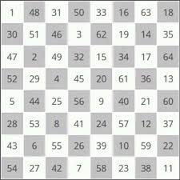
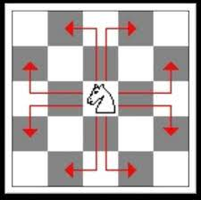

# horse-chess-search-algorithm

## Description

Fazer um programa que resolva o problema da volta do cavalo no tabuleiro de xadrez, utilizando métodos de busca. A equipe deve fundamentar o método ou heurística utilizada e explicar como foi implementado.

O usuário deverá informar qual a casa de inicio do passeio do cavalo e o programa indicar todo o restante do percurso, numerando cada casa visitada de 1 (primeira, informada pelo usuário) a 64 (ultima casa visitada).

Gravar um video com a apresentação da solução. Deve ser explicado a heurística utilizada e como ela foi implementada, além da execução do programa.O video deve ser colocado no youtube (ou similar) e o link para visualização entregue no material didático junto com os fontes e executavel da aplicação.

Trabalho pode ser feito em equipes de até 3 integrantes e todos devem participar efetivamente da apresentação.

OBS.: É obrigatório a entrega de uma versão executavel (que possa ser executada em qualquer maquina sem necessidade de compilação ou qualquer outra dependencia).

Exemplo de saida do programa:

[]

Exemplo de movimentação do cavalo no Xadrez:

[]
